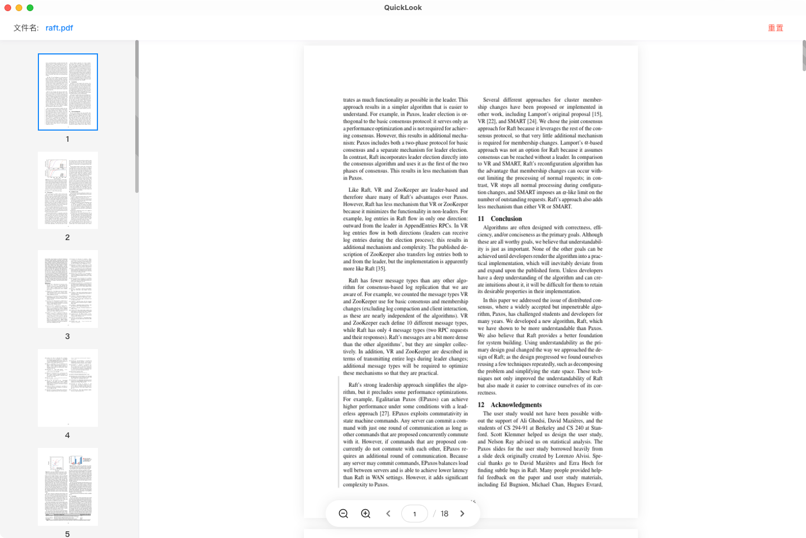

# Quick Look
Quickly view a file .

## Usage
- 支持 `js`、`css`、`tsx`、`vue`、`toml` 等文件
- 支持 `jpg`、`jpeg`、`png`、`gif`、`bmp`、`ico`、`heic` 等图片
- 支持 `zip`、`gz`、`rar`、`7z`、`bz2` 等压缩包
- 支持 `pdf` 查看

## Preview




## 运行
```shell
make run
```

## 构建
```shell
make build
```